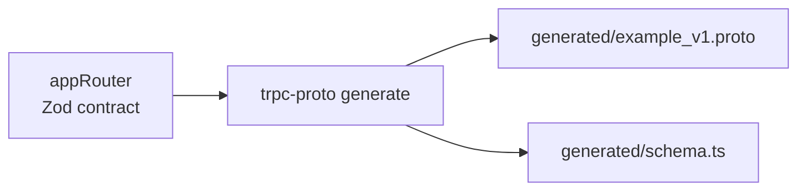
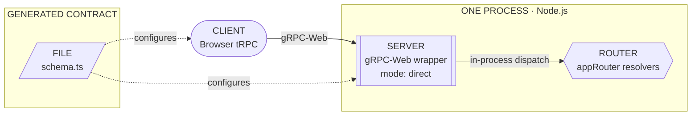
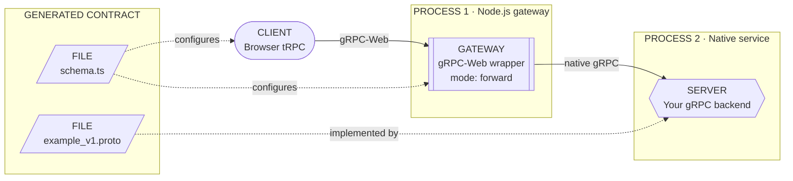

# trpc-proto

Serve tRPC 11 over gRPC-Web transport.

> **[Visual overview](https://iocat.github.io/trpc-proto/)** ·
> **[Detailed documentation →](https://iocat.github.io/trpc-proto/guide.html)**

The simplest—and recommended—setup is **direct mode**: your browser calls the
included Node.js gRPC-Web server, which invokes your existing tRPC router in the
same process. You do not need to build a separate gRPC backend.

`trpc-proto` is intentionally strict. It accepts only the app-router schema
subset that protobuf can represent faithfully. Unsupported contracts fail
during generation instead of being approximated.

> Missing a useful schema construct? Please
> [open an issue](https://github.com/iocat/trpc-proto/issues).

| Your application                                                     | Start with                                                 |
| -------------------------------------------------------------------- | ---------------------------------------------------------- |
| TypeScript owns the procedure implementations                        | [Direct mode](#start-here-direct-mode)                     |
| Go, Rust, Java, or another service implements the generated contract | [Forward mode](#forward-mode-use-a-non-typescript-backend) |

## Start here: direct mode

Use direct mode when your TypeScript tRPC router contains the real procedure
implementations. This is the base use case and the best place to start.

Generate the contract from the router:



At runtime, the generated schema configures the browser client and the included
Node server. The router and server stay in one process:



The setup has four steps: install the packages, define a router, generate the
contract, and connect the server and browser client.

### 1. Install

`trpc-proto` requires Node.js 22+, tRPC 11, Zod 4, and TypeScript 5.9+.

```bash
npm install @trpc/client @trpc/server @trpc-proto/runtime @grpc/grpc-js zod
npm install --save-dev @trpc-proto/plugin typescript tsx
```

### 2. Define your router

Define procedures as usual, with two additions:

1. Give the router a protobuf package through `defaultMeta`.
2. Add an explicit `.output()` Zod schema to every procedure.

Save this as `src/router.ts`:

```ts
import { initTRPC } from '@trpc/server';
import type { ProtoMeta } from '@trpc-proto/runtime';
import { z } from 'zod';

const t = initTRPC.meta<ProtoMeta>().create({
  defaultMeta: {
    proto: {
      package: 'example.v1',
      schemaPath: 'generated/schema.ts',
    },
  },
});

const User = z
  .object({
    id: z.string(),
    name: z.string(),
  })
  .meta({ protoMessageName: 'User' });

export const appRouter = t.router({
  getUser: t.procedure
    .input(z.object({ id: z.string() }))
    .output(User)
    .query(async ({ input }) => {
      // Call your database or application service here.
      return { id: input.id, name: 'Ada' };
    }),
});

export type AppRouter = typeof appRouter;
```

The generated schema keeps protobuf field numbers stable between generations.
Commit `generated/schema.ts` along with your source. The generator evaluates the
exported router to inspect its Zod schemas, so keep browser imports type-only:
`import type { AppRouter } from './router.js'`.

### 3. Generate the contract

`npx` resolves the `trpc-proto` binary installed with
`@trpc-proto/plugin`; pnpm is not required.

```bash
npx trpc-proto generate \
  --router src/router.ts \
  --export appRouter \
  --out generated
```

This writes:

- `generated/example_v1.proto` — the contract for normal protobuf stub generation.
- `generated/schema.ts` — runtime schema data used by the TypeScript transports and as the stable field-number cache.

Keep both generated files in version control. `schema.ts` is runtime data and
generator state: when a field is deleted, it preserves the old number so the
generated `.proto` marks it as `reserved`, preventing accidental wire-format
reuse.

The same operation is available programmatically:

```ts
import { generate } from '@trpc-proto/plugin';

await generate({
  routerFile: 'src/router.ts',
  routerExport: 'appRouter',
  outDir: 'generated',
});
```

### 4. Start the direct server

Save this as `src/server.ts`:

```ts
import { serveGrpcWeb } from '@trpc-proto/runtime';
import { protoSchema } from '../generated/schema.js';
import { appRouter } from './router.js';

const server = await serveGrpcWeb({
  mode: 'direct',
  router: appRouter,
  schema: protoSchema,
  address: '127.0.0.1:50052',
  cors: {
    allowedOrigins: ['http://localhost:5173'],
  },
});

console.log(`gRPC-Web listening on http://${server.address}`);
```

Run it with:

```bash
npx tsx src/server.ts
```

Then create the browser client in `src/client.ts` (or the equivalent entry file
for your frontend):

```ts
import { createTRPCClient } from '@trpc/client';
import { grpcWebLink } from '@trpc-proto/runtime/web';
import { protoSchema } from '../generated/schema.js';
import type { AppRouter } from './router.js';

const client = createTRPCClient<AppRouter>({
  links: [
    grpcWebLink<AppRouter>({
      // Required: the generated runtime schema.
      schema: protoSchema,

      // Optional string. Default: '' (same origin).
      url: 'http://127.0.0.1:50052',

      // Optional: 'raw' | 'base64'. Default: 'base64'.
      encoding: 'raw',

      // Optional: true | false. Default: false.
      compress: false,

      // Optional: false | true | { maxItems?: number }. Default: false; maxItems: 100.
      batch: { maxItems: 100 },

      // Optional AuthConfig. Default: undefined.
      auth: {
        // Optional string or sync/async getter. Default: undefined.
        token: () => localStorage.getItem('accessToken') ?? undefined,
        // Optional metadata record or sync/async getter. Default: undefined.
        metadata: {},
        // Optional string. Default: 'authorization'.
        header: 'authorization',
        // Optional string. Default: 'Bearer'; use '' for a raw token.
        scheme: 'Bearer',
      },

      // Optional CallInterceptor[]. Default: [].
      interceptors: [],
    }),
  ],
});

const user = await client.getUser.query({ id: '1' });
```

That is the complete direct-mode path: browser calls arrive at
`serveGrpcWeb`, are decoded using `protoSchema`, and invoke `appRouter` without
another service or network hop.

If your router uses context, pass `createContext` to `serveGrpcWeb`. One context
is created for a normal call; all procedures in a direct batch share one context
and execute concurrently.

## Browser client options

With `batch: true` or `batch: { maxItems }`:

- Queries and mutations queued in the same microtask are coalesced.
- Queries and mutations use separate batches.
- Procedures within a batch execute concurrently.
- Subscriptions continue through the normal server-streaming transport.
- `maxItems` only controls client request splitting; servers have no matching limit.

During development, put tRPC's `loggerLink()` before `grpcWebLink` to inspect
decoded inputs and results when protobuf payloads are opaque in the browser
Network panel.

## Forward mode: use a non-TypeScript backend

Direct mode is the recommended starting point, but you can keep the same
generated contract and browser client when Go, Rust, Java, or another service
owns the implementation. In this setup, each file and server runs in a distinct
role:



Implement `generated/example_v1.proto` with your backend's normal protobuf
tooling, start its native gRPC server, and point the gateway at it:

```ts
import { serveGrpcWeb } from '@trpc-proto/runtime';
import { protoSchema } from '../generated/schema.js';

const server = await serveGrpcWeb({
  mode: 'forward',
  schema: protoSchema,
  address: '127.0.0.1:50052',
  backend: {
    address: '127.0.0.1:50051',
    credentials: { type: 'insecure' },
  },
  cors: {
    allowedOrigins: ['https://app.example.com'],
  },
});

// During graceful shutdown:
await server.close();
```

The browser still connects to port `50052` using the client shown above and
does not need to know whether the gateway uses direct or forward mode. Batching
is supported in both modes; the gateway owns gRPC-Web framing, CORS, and
compression.

## Native Node client

Use `grpcLink` when a Node client should call a native gRPC server directly:

```ts
import { createTRPCClient } from '@trpc/client';
import { grpcLink } from '@trpc-proto/runtime';

const client = createTRPCClient<AppRouter>({
  links: [
    grpcLink<AppRouter>({
      schema: protoSchema,
      address: '127.0.0.1:50051',
      auth: { token: process.env.AUTH_TOKEN },
    }),
  ],
});
```

To expose a direct TypeScript router to native gRPC clients, use `serveGrpc`:

```ts
import { serveGrpc } from '@trpc-proto/runtime';

await serveGrpc(appRouter, {
  schema: protoSchema,
  address: '127.0.0.1:50051',
});
```

Use `bindRouter` instead when an existing grpc-js server owns service
registration.

## Supported router contract

### Router rules

| Contract                                                      | Requirement                                                                 |
| ------------------------------------------------------------- | --------------------------------------------------------------------------- |
| `initTRPC.meta<ProtoMeta>()` with `defaultMeta.proto.package` | Required                                                                    |
| `proto.syntax`                                                | Optional; only proto3 is supported                                          |
| `proto.schemaPath`                                            | Optional generated schema path and stable field-number cache                |
| `proto.cache`                                                 | Deprecated alias for `proto.schemaPath`                                     |
| `proto.options`                                               | Optional protobuf options such as `go_package`                              |
| Procedure `.output()`                                         | Required                                                                    |
| Procedure `.input()`                                          | Optional; omitted input becomes `google.protobuf.Empty`                     |
| Chained `.input()`                                            | Rejected; merge it into one Zod schema                                      |
| Procedure types                                               | Query and mutation become unary RPCs; subscription becomes server streaming |
| Validators                                                    | Zod 4 only                                                                  |
| Procedure-level `proto` metadata                              | Rejected; the protobuf file header is router-global                         |

### Zod to protobuf

| Zod                                                        | Protobuf                                              |
| ---------------------------------------------------------- | ----------------------------------------------------- |
| `z.object`, including nested objects                       | `message`                                             |
| `.meta({ protoMessageName: 'User' })`                      | Named message; name must be PascalCase                |
| `.meta({ protoUseKnownType: 'google.protobuf.Duration' })` | Selected well-known type                              |
| `.meta({ protoEnumName: 'UserRole' })`                     | Named enum; name must be PascalCase                   |
| Unnamed nested object                                      | Nested message named from the field                   |
| `z.string`, template literal                               | `string`; formats such as email remain strings        |
| `z.boolean`                                                | `bool`                                                |
| `z.number`, `z.int`                                        | `double`, `int32`, `int64`, and other integer formats |
| `z.bigint`                                                 | `int64`                                               |
| `z.date`                                                   | `google.protobuf.Timestamp`                           |
| `z.enum`, same-type literal union                          | `enum`                                                |
| `z.discriminatedUnion`                                     | `oneof` of variant messages                           |
| `z.array`, `z.set`                                         | `repeated`                                            |
| `z.record`, `z.map`                                        | `map<key, value>` with scalar keys                    |
| `z.any`, `z.unknown`                                       | `google.protobuf.Value`                               |
| Record of `any` or `unknown`                               | `google.protobuf.Struct`                              |
| Void, undefined, never, or null input/output               | `google.protobuf.Empty`                               |
| `z.optional`, `z.nullable`                                 | Optional field                                        |
| `zAsyncIterable({ yield: schema })`                        | Server stream using `schema` as the response item     |

Generation rejects open unions, mixed-type literals, mixed integer/float literals, invalid protobuf names, non-scalar map keys, and unsupported Zod types. Prevalidation collects all issues before aborting.

Do not expect tRPC-only behavior that has no protobuf representation—such as output inference without `.output()` or superjson-only values—to round-trip through the generated contract.

### Unsupported examples

The following contracts are intentionally rejected rather than translated
approximately:

```ts
const unsupportedRouter = t.router({
  // Every procedure needs an explicit output schema.
  missingOutput: t.procedure
    .input(z.object({ id: z.string() }))
    .query(noopForNonTsBackend),

  // Merge this into one object instead of chaining input parsers.
  chainedInput: t.procedure
    .input(z.object({ id: z.string() }))
    .input(z.object({ revision: z.int() }))
    .output(z.object({ ok: z.boolean() }))
    .query(noopForNonTsBackend),

  // Object unions need a literal discriminator and z.discriminatedUnion().
  openObjectUnion: t.procedure
    .input(
      z.union([
        z.object({ email: z.string() }),
        z.object({ phone: z.string() }),
      ]),
    )
    .output(z.object({ ok: z.boolean() }))
    .query(noopForNonTsBackend),

  // Protobuf enums cannot mix literal value types.
  mixedLiteralTypes: t.procedure
    .input(z.object({ state: z.literal(['active', 1]) }))
    .output(z.object({ ok: z.boolean() }))
    .query(noopForNonTsBackend),

  // A numeric literal enum cannot mix integer and floating-point values.
  mixedNumberKinds: t.procedure
    .input(z.object({ value: z.literal([1, 1.5]) }))
    .output(z.object({ ok: z.boolean() }))
    .query(noopForNonTsBackend),

  // Protobuf map keys must map to a supported scalar key type.
  objectMapKey: t.procedure
    .input(
      z.object({
        values: z.map(z.object({ id: z.string() }), z.string()),
      }),
    )
    .output(z.object({ ok: z.boolean() }))
    .query(noopForNonTsBackend),

  // Explicit protobuf message and enum names must be PascalCase.
  invalidMessageName: t.procedure
    .input(
      z.object({ id: z.string() }).meta({ protoMessageName: 'user_record' }),
    )
    .output(z.object({ ok: z.boolean() }))
    .query(noopForNonTsBackend),
});
```

Generation reports the procedure path and reason for each violation. Fix the
contract at the router boundary; the generator does not insert lossy fallback
types.

See [packages/runtime/GRPC_WEB.md](packages/runtime/GRPC_WEB.md) for framing, compression, CORS, status, and forwarding details.

## Workspace

```text
packages/plugin      @trpc-proto/plugin          router evaluation and protobuf generation
packages/runtime     @trpc-proto/runtime         native gRPC and gRPC-Web transports
packages/schema_ir   @trpc-proto/schema_ir       schema IR, validation, and protobuf rendering
packages/utility     @trpc-proto/utility          shared internal helpers

examples/users       Go backend with forwarded gRPC-Web
examples/todo        Go backend with forwarded gRPC-Web
examples/trpc        direct TypeScript gRPC-Web server
examples/streaming   Rust backend, batching, CRUD, and server streaming
```

## Examples

The published package setup above uses npm and `npx`. The commands below are
only for running this repository's pnpm workspace after cloning it.

```bash
# Go backend and forwarded gRPC-Web
pnpm --filter @trpc-proto/example-users generate
pnpm --filter @trpc-proto/example-users generate:go
pnpm --filter @trpc-proto/example-users server
pnpm --filter @trpc-proto/example-users web

# Direct TypeScript gRPC-Web
pnpm --filter @trpc-proto/example-trpc generate
pnpm --filter @trpc-proto/example-trpc web

# Rust backend, browser batching, and server streaming
pnpm --filter @trpc-proto/example-streaming generate
pnpm --filter @trpc-proto/example-streaming test:rust
pnpm --filter @trpc-proto/example-streaming server
pnpm --filter @trpc-proto/example-streaming web
```

## Contributing

See [CONTRIBUTING.md](CONTRIBUTING.md) for development and pull request guidance. Report vulnerabilities according to [SECURITY.md](SECURITY.md).

## License

[MIT](LICENSE) © Thanh Ngo
