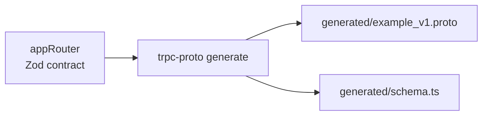
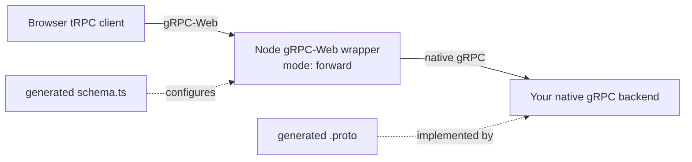
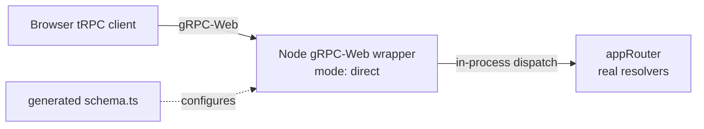

# trpc-proto

Generate Protocol Buffers from a tRPC 11 + Zod 4 router, then use the same typed tRPC client over native gRPC or gRPC-Web.

`trpc-proto` is intentionally strict: only the app-router schema subset that can be represented faithfully in protobuf is accepted. Unsupported contracts fail during generation instead of being approximated.

> Please file an issue when a useful schema construct is missing from the
> supported subset.

## Choose a deployment mode

Every browser deployment includes the Node.js gRPC-Web wrapper provided by
`@trpc-proto/runtime`. It owns the HTTP endpoint, gRPC-Web framing, CORS,
compression, and batching. The only choice is what runs behind that wrapper:

| Mode                                                         | Wrapper behavior                               | Where procedures run                              |
| ------------------------------------------------------------ | ---------------------------------------------- | ------------------------------------------------- |
| [Provide your own backend](#mode-1-provide-your-own-backend) | `mode: 'forward'` sends normal native gRPC     | Your Go, Rust, Java, or other native gRPC service |
| [Direct gRPC-Web server](#mode-2-direct-grpc-web-server)     | `mode: 'direct'` invokes the router in-process | The TypeScript `appRouter` process                |

### Generate the shared contract



The browser client and generated contract are identical in both modes.

### Mode 1: provide your own backend



You provide a normal native gRPC backend, not a gRPC-Web endpoint. The included
Node wrapper serves gRPC-Web to browsers and forwards each call to your backend.
The TypeScript router is the schema source; generate its `.proto` and implement
that contract in your backend language.

### Mode 2: direct gRPC-Web server



The same Node wrapper serves gRPC-Web, but invokes real router resolvers
in-process instead of forwarding over native gRPC. No separate backend service
is required.

## Requirements and repository setup

- tRPC 11
- Zod 4
- TypeScript 5.9+
- pnpm 10 for this workspace

```bash
corepack enable
pnpm install --frozen-lockfile
pnpm build
```

## Define the protobuf contract

Every generated router needs `defaultMeta.proto.package`. Add a cache path to keep protobuf field numbers stable across generations.

```ts
import { initTRPC } from '@trpc/server';
import {
  noopForNonTsBackend,
  zAsyncIterable,
  type ProtoMeta,
} from '@trpc-proto/runtime';
import { z } from 'zod';

const t = initTRPC.meta<ProtoMeta>().create({
  defaultMeta: {
    proto: {
      package: 'example.v1',
      cache: 'generated/schema.ts',
      options: { go_package: 'backend/gen/examplev1' },
    },
  },
});

const User = z
  .object({
    id: z.string(),
    name: z.string(),
  })
  .meta({ protoMessageName: 'User' });

export const appRouter = t.router({
  user: t.router({
    getById: t.procedure
      .input(z.object({ id: z.string() }))
      .output(User)
      .query(noopForNonTsBackend),

    onChange: t.procedure
      .output(zAsyncIterable({ yield: User }))
      .subscription(noopForNonTsBackend),
  }),
});

export type AppRouter = typeof appRouter;
```

`noopForNonTsBackend` marks schema-only procedures when another service implements the generated RPC. For direct mode, replace it with the real query, mutation, or subscription resolver.

The generator evaluates the exported router value so it can inspect the Zod parsers. Browser code should import `AppRouter` with `import type` and use the generated data-only schema; importing the router value into a browser bundle can pull in database clients and Node-only modules.

## Generate

```bash
trpc-proto generate \
  --router src/router.ts \
  --export appRouter \
  --out generated
```

This writes:

- `generated/example_v1.proto` — the contract for normal protobuf stub generation.
- `generated/schema.ts` — runtime schema data used by the TypeScript transports and as the stable field-number cache.

The same operation is available programmatically:

```ts
import { generate } from '@trpc-proto/plugin';

await generate({
  routerFile: 'src/router.ts',
  routerExport: 'appRouter',
  outDir: 'generated',
});
```

Deleted fields remain in the cache and are emitted as `reserved`, preventing accidental field-number reuse:

```proto
message User {
  optional string id = 1;
  reserved 2, 4;
}
```

## Mode 1: provide your own backend

Use this mode when Go, Rust, Java, or another service owns the native gRPC
implementation. Browsers still connect to the Node gRPC-Web wrapper supplied by
`@trpc-proto/runtime`.

### 1. Implement the generated protobuf service

Feed `generated/example_v1.proto` into the normal generator for your backend language, implement the generated service interface, and start a native gRPC server. The backend does not import the TypeScript router or `generated/schema.ts`.

The [`users`](examples/users) and [`todo`](examples/todo) examples use Go backends. The [`streaming`](examples/streaming) example uses Rust.

### 2. Run the provided Node gRPC-Web wrapper

```ts
import { serveGrpcWeb } from '@trpc-proto/runtime';
import { protoSchema } from './generated/schema.js';

const server = await serveGrpcWeb({
  mode: 'forward',
  schema: protoSchema,
  address: '127.0.0.1:50052',
  backend: {
    address: '127.0.0.1:50051',
    credentials: { type: 'insecure' },
  },
  cors: {
    allowedOrigins: ['https://app.example.com'],
  },
});

// During shutdown:
await server.close();
```

`serveGrpcWeb({ mode: 'forward' })` is the provided Node wrapper. It serves the
browser-facing gRPC-Web endpoint and translates each call to native gRPC. When
browser batching is enabled, the wrapper unwraps the batch and forwards ordinary
application RPCs concurrently. Your backend does not implement
`trpc.batch.v1.BatchService` and has no gRPC-Web or batch configuration.

## Mode 2: direct gRPC-Web server

Use this mode when the TypeScript router owns the real procedure implementations.
The provided Node wrapper serves the same browser-facing gRPC-Web endpoint as
forwarding mode.

```ts
import { initTRPC } from '@trpc/server';
import { serveGrpcWeb, type ProtoMeta } from '@trpc-proto/runtime';
import { z } from 'zod';
import { protoSchema } from './generated/schema.js';

const t = initTRPC
  .context<{ userId: string }>()
  .meta<ProtoMeta>()
  .create({
    defaultMeta: { proto: { package: 'example.v1' } },
  });

const appRouter = t.router({
  user: t.router({
    getById: t.procedure
      .input(z.object({ id: z.string() }))
      .output(z.object({ id: z.string(), name: z.string() }))
      .query(async ({ input, ctx }) => {
        return loadUser(input.id, ctx.userId);
      }),
  }),
});

const server = await serveGrpcWeb({
  mode: 'direct',
  router: appRouter,
  schema: protoSchema,
  address: '127.0.0.1:50052',
  createContext: async () => ({ userId: await authenticate() }),
  cors: {
    allowedOrigins: ['https://app.example.com'],
  },
});

// During shutdown:
await server.close();
```

`createContext` supplies the normal tRPC `ctx`. A non-batched call gets one
context; procedures in one direct batch share one context and execute
concurrently, matching tRPC batch semantics. The wrapper always recognizes the
built-in batch endpoint, so neither mode has a server-side `batch` option.

### Optional native gRPC server

A TypeScript router can also serve native gRPC clients:

```ts
import { serveGrpc } from '@trpc-proto/runtime';

await serveGrpc(appRouter, {
  schema: protoSchema,
  address: '127.0.0.1:50051',
  createContext: () => ({ userId: 'service-account' }),
});
```

Use `bindRouter` instead when an existing grpc-js server owns service registration.

## Browser client for either mode

The browser configuration does not change between direct and forwarding deployments:

```ts
import { createTRPCClient } from '@trpc/client';
import { grpcWebLink } from '@trpc-proto/runtime/web';
import { protoSchema } from './generated/schema.js';
import type { AppRouter } from './router.js';

const client = createTRPCClient<AppRouter>({
  links: [
    grpcWebLink<AppRouter>({
      schema: protoSchema,
      url: 'https://api.example.com',
      encoding: 'raw',
      batch: { maxItems: 100 },
    }),
  ],
});

const user = await client.user.getById.query({ id: '1' });
```

With `batch: true` or `batch: { maxItems }`:

- Queries and mutations queued in the same microtask are coalesced.
- Queries and mutations use separate batches.
- Procedures within a batch execute concurrently.
- Subscriptions continue through the normal server-streaming transport.
- `maxItems` only controls client request splitting; servers have no matching limit.

The standalone `grpcWebBatchLink` remains available for manual link composition,
but it rejects subscriptions. During development, put tRPC's `loggerLink()`
before `grpcWebLink` to inspect decoded inputs and results when protobuf payloads
are opaque in the browser Network panel.

## Native Node client

Use `grpcLink` when a Node client should call a native gRPC server directly:

```ts
import { createTRPCClient } from '@trpc/client';
import { grpcLink } from '@trpc-proto/runtime';

const client = createTRPCClient<AppRouter>({
  links: [
    grpcLink<AppRouter>({
      schema: protoSchema,
      address: '127.0.0.1:50051',
      auth: { token: process.env.AUTH_TOKEN },
    }),
  ],
});
```

## Supported router contract

### Router rules

| Contract                                                      | Requirement                                                                 |
| ------------------------------------------------------------- | --------------------------------------------------------------------------- |
| `initTRPC.meta<ProtoMeta>()` with `defaultMeta.proto.package` | Required                                                                    |
| `proto.syntax`                                                | Optional; only proto3 is supported                                          |
| `proto.cache`                                                 | Optional stable field-number cache                                          |
| `proto.options`                                               | Optional protobuf options such as `go_package`                              |
| Procedure `.output()`                                         | Required                                                                    |
| Procedure `.input()`                                          | Optional; omitted input becomes `google.protobuf.Empty`                     |
| Chained `.input()`                                            | Rejected; merge it into one Zod schema                                      |
| Procedure types                                               | Query and mutation become unary RPCs; subscription becomes server streaming |
| Validators                                                    | Zod 4 only                                                                  |
| Procedure-level `proto` metadata                              | Rejected; the protobuf file header is router-global                         |

### Zod to protobuf

| Zod                                                        | Protobuf                                              |
| ---------------------------------------------------------- | ----------------------------------------------------- |
| `z.object`, including nested objects                       | `message`                                             |
| `.meta({ protoMessageName: 'User' })`                      | Named message; name must be PascalCase                |
| `.meta({ protoUseKnownType: 'google.protobuf.Duration' })` | Selected well-known type                              |
| `.meta({ protoEnumName: 'UserRole' })`                     | Named enum; name must be PascalCase                   |
| Unnamed nested object                                      | Nested message named from the field                   |
| `z.string`, template literal                               | `string`; formats such as email remain strings        |
| `z.boolean`                                                | `bool`                                                |
| `z.number`, `z.int`                                        | `double`, `int32`, `int64`, and other integer formats |
| `z.bigint`                                                 | `int64`                                               |
| `z.date`                                                   | `google.protobuf.Timestamp`                           |
| `z.enum`, same-type literal union                          | `enum`                                                |
| `z.discriminatedUnion`                                     | `oneof` of variant messages                           |
| `z.array`, `z.set`                                         | `repeated`                                            |
| `z.record`, `z.map`                                        | `map<key, value>` with scalar keys                    |
| `z.any`, `z.unknown`                                       | `google.protobuf.Value`                               |
| Record of `any` or `unknown`                               | `google.protobuf.Struct`                              |
| Void, undefined, never, or null input/output               | `google.protobuf.Empty`                               |
| `z.optional`, `z.nullable`                                 | Optional field                                        |
| `zAsyncIterable({ yield: schema })`                        | Server stream using `schema` as the response item     |

Generation rejects open unions, mixed-type literals, mixed integer/float literals, invalid protobuf names, non-scalar map keys, and unsupported Zod types. Prevalidation collects all issues before aborting.

Do not expect tRPC-only behavior that has no protobuf representation—such as output inference without `.output()` or superjson-only values—to round-trip through the generated contract.

### Unsupported examples

The following contracts are intentionally rejected rather than translated
approximately:

```ts
const unsupportedRouter = t.router({
  // Every procedure needs an explicit output schema.
  missingOutput: t.procedure
    .input(z.object({ id: z.string() }))
    .query(noopForNonTsBackend),

  // Merge this into one object instead of chaining input parsers.
  chainedInput: t.procedure
    .input(z.object({ id: z.string() }))
    .input(z.object({ revision: z.int() }))
    .output(z.object({ ok: z.boolean() }))
    .query(noopForNonTsBackend),

  // Object unions need a literal discriminator and z.discriminatedUnion().
  openObjectUnion: t.procedure
    .input(
      z.union([
        z.object({ email: z.string() }),
        z.object({ phone: z.string() }),
      ]),
    )
    .output(z.object({ ok: z.boolean() }))
    .query(noopForNonTsBackend),

  // Protobuf enums cannot mix literal value types.
  mixedLiteralTypes: t.procedure
    .input(z.object({ state: z.literal(['active', 1]) }))
    .output(z.object({ ok: z.boolean() }))
    .query(noopForNonTsBackend),

  // A numeric literal enum cannot mix integer and floating-point values.
  mixedNumberKinds: t.procedure
    .input(z.object({ value: z.literal([1, 1.5]) }))
    .output(z.object({ ok: z.boolean() }))
    .query(noopForNonTsBackend),

  // Protobuf map keys must map to a supported scalar key type.
  objectMapKey: t.procedure
    .input(
      z.object({
        values: z.map(z.object({ id: z.string() }), z.string()),
      }),
    )
    .output(z.object({ ok: z.boolean() }))
    .query(noopForNonTsBackend),

  // Explicit protobuf message and enum names must be PascalCase.
  invalidMessageName: t.procedure
    .input(
      z.object({ id: z.string() }).meta({ protoMessageName: 'user_record' }),
    )
    .output(z.object({ ok: z.boolean() }))
    .query(noopForNonTsBackend),
});
```

Generation reports the procedure path and reason for each violation. Fix the
contract at the router boundary; the generator does not insert lossy fallback
types.

See [packages/runtime/GRPC_WEB.md](packages/runtime/GRPC_WEB.md) for framing, compression, CORS, status, and forwarding details.

## Workspace

```text
packages/plugin      @trpc-proto/plugin          router evaluation and protobuf generation
packages/runtime     @trpc-proto/runtime         native gRPC and gRPC-Web transports
packages/schema_ir   @trpc-proto/schema_ir       schema IR, validation, and protobuf rendering
packages/utility     @trpc-proto/utility          shared internal helpers

examples/users       Go backend with forwarded gRPC-Web
examples/todo        Go backend with forwarded gRPC-Web
examples/trpc        direct TypeScript gRPC-Web server
examples/streaming   Rust backend, batching, CRUD, and server streaming
```

## Examples

```bash
# Go backend and forwarded gRPC-Web
pnpm --filter @trpc-proto/example-users generate
pnpm --filter @trpc-proto/example-users generate:go
pnpm --filter @trpc-proto/example-users server
pnpm --filter @trpc-proto/example-users web

# Direct TypeScript gRPC-Web
pnpm --filter @trpc-proto/example-trpc generate
pnpm --filter @trpc-proto/example-trpc web

# Rust backend, browser batching, and server streaming
pnpm --filter @trpc-proto/example-streaming generate
pnpm --filter @trpc-proto/example-streaming test:rust
pnpm --filter @trpc-proto/example-streaming server
pnpm --filter @trpc-proto/example-streaming web
```

## Contributing

See [CONTRIBUTING.md](CONTRIBUTING.md) for development and pull request guidance. Report vulnerabilities according to [SECURITY.md](SECURITY.md).

## License

[MIT](LICENSE) © Thanh Ngo
