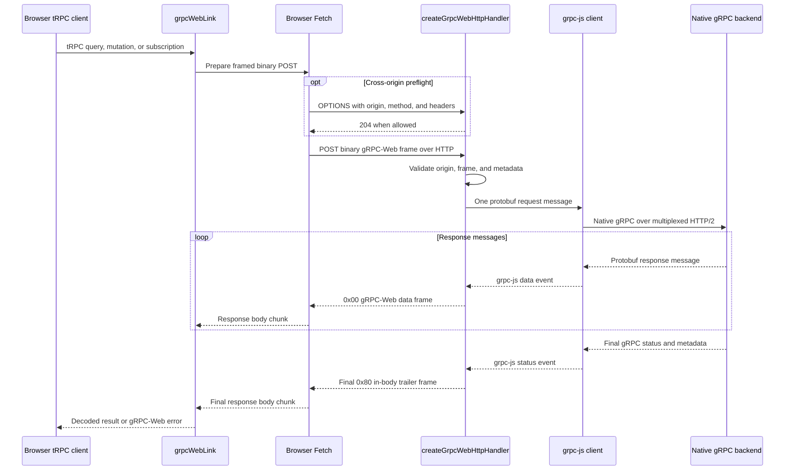

# gRPC-Web runtime

## Request path



This document describes the behavior currently implemented by
`@trpc-proto/runtime`. It is an implementation reference, not a claim of full
[gRPC-Web protocol](https://github.com/grpc/grpc/blob/master/doc/PROTOCOL-WEB.md)
or production deployment readiness.

## Components

| Component | File | Responsibility |
| --- | --- | --- |
| `grpcWebLink` | `src/web/link.ts` | tRPC client link that protobuf-encodes input and calls the Fetch transport. |
| Fetch transport | `src/web/protocol.ts` | Builds binary gRPC-Web requests and decodes unary or server-streaming responses. |
| `createGrpcWebHttpHandler` | `src/web/http_handler.ts` | Node HTTP handler that validates the web boundary and forwards requests to grpc-js. |
| Frame helpers | `src/web/protocol.ts` | Encode and decode data and in-body trailer frames. |

The browser link and Node HTTP handler do not inspect protobuf payloads. The
shared runtime codec translates tRPC values before and after transport.

## Public API

### Browser or Fetch client

```ts
import { createTRPCClient } from '@trpc/client';
import { grpcWebLink } from '@trpc-proto/runtime';

const client = createTRPCClient<AppRouter>({
  links: [
    grpcWebLink({
      router: appRouter,
      url: 'https://api.example.com',
    }),
  ],
});
```

`url` defaults to an empty string, which sends requests to the current origin.
The procedure's translated service and method determine the URL pathname.

### Node HTTP handler

```ts
import http from 'node:http';
import { createGrpcWebHttpHandler } from '@trpc-proto/runtime';

const handleGrpcWeb = createGrpcWebHttpHandler({
  address: '127.0.0.1:50051',
});

http.createServer(async (req, res) => {
  if (await handleGrpcWeb(req, res)) return;

  res.writeHead(404);
  res.end();
});
```

The handler returns `true` after it writes a response. It returns `false` for a
request it does not own, allowing the surrounding server to continue routing.
The handler currently accepts gRPC-Web `POST` requests through Node's
`node:http` request and response types. HTTP/2 ingress is not implemented or
tested.

The upstream address defaults to `127.0.0.1:50051`. The upstream channel is
insecure unless `credentials` is provided.

## Binary wire format

Only binary protobuf gRPC-Web is implemented. Requests and responses use:

```text
content-type: application/grpc-web+proto
```

Each frame is length-prefixed:

```text
+---------+--------------------+-------------------+
| flags   | payload length     | payload           |
| 1 byte  | 4 bytes, big-endian| length bytes      |
+---------+--------------------+-------------------+
```

Implemented flags:

| Flag | Meaning | Current behavior |
| --- | --- | --- |
| `0x00` | Uncompressed protobuf data | Supported. |
| `0x01` | Compressed protobuf data | Rejected. |
| `0x80` | Uncompressed in-body trailers | Supported. |
| `0x81` | Compressed in-body trailers | Rejected. |

The decoders reject truncated frame headers and payloads. They do not yet
reject every unknown flag combination or enforce that a trailer frame is the
last frame.

## Request flow

The Fetch transport sends one framed protobuf message:

```text
POST /<package>.<service>/<method>
content-type: application/grpc-web+proto
x-grpc-web: 1
x-user-agent: grpc-web-javascript/0.1

[0x00][uint32 length][protobuf payload]
```

Interceptor metadata is added as HTTP request headers. The caller's
`AbortSignal` is passed to `fetch`.

The HTTP handler:

1. Handles a configured CORS preflight, if applicable.
2. Returns `false` unless the request is a `POST` with a gRPC-Web content type.
3. Applies configured origin validation.
4. Reads the complete request body into memory.
5. Requires exactly one data frame.
6. Converts permitted request headers into grpc-js metadata.
7. sends one native gRPC request message upstream.

Client-streaming and bidirectional-streaming request bodies are not supported.
There is no request-body size limit yet.

`isGrpcWebContentType` currently recognizes any content type containing
`application/grpc-web`. This includes `application/grpc-web-text`, but text
base64 decoding is not implemented. A text request therefore reaches the
binary decoder and fails. Applications should send
`application/grpc-web+proto` only.

## Response and streaming flow

Every upstream call uses grpc-js's server-stream response API. This is
transport-level behavior and does not require a private request header or a
protobuf method descriptor:

1. Each upstream `data` event becomes one `0x00` gRPC-Web data frame.
2. The final grpc-js `status` event becomes one `0x80` trailer frame.
3. The HTTP response ends after the trailer frame.

A unary RPC naturally produces one data frame followed by trailers. A
server-streaming RPC produces zero or more data frames followed by trailers.
The removed `x-grpc-web-stream` private header is not part of the current
protocol.

The Fetch transport handles the response according to the tRPC operation:

- Query and mutation calls buffer the response, decode all frames, check the
  status trailer, and return the first data message.
- Subscription calls incrementally buffer Fetch chunks until complete frames
  are available, yield each data payload, and finish at the trailer frame.

Binary frames may be split across arbitrary Fetch chunks. The incremental
reader retains incomplete bytes until the complete frame is available.

## Trailers and errors

Native gRPC response trailers are encoded into the response body because the
browser Fetch API cannot expose HTTP/2 trailing headers consistently. The
trailer payload is a lower-case HTTP-style header block:

```text
grpc-status: 0\r\n
grpc-message: \r\n
```

The frame containing this block has flag `0x80`. Additional string grpc-js
status metadata is copied into the block. Binary status metadata is currently
omitted.

`grpc-message` and additional values are percent-encoded when the handler
writes trailers. The Fetch client does not yet percent-decode them.

Transport outcomes:

| Condition | HTTP result | gRPC-Web result |
| --- | --- | --- |
| Successful upstream call | `200` | Data frames followed by `grpc-status: 0`. |
| Upstream gRPC error | `200` | Final trailer contains the upstream status, message, and string metadata. |
| Malformed framed request | `200` | Final trailer contains `grpc-status: 13` (`INTERNAL`). |
| Request not owned by handler | No response written | Handler returns `false`. |
| Rejected CORS origin or header | `403` | No upstream call. |
| Rejected preflight method | `405` | `POST` reported as the allowed method. |

For buffered unary responses, a missing status trailer currently defaults to
status `0` when the HTTP response is successful. For streaming responses, EOF
without a trailer currently ends the iterator without an error. Strict final
status enforcement remains backlog work.

## CORS behavior

CORS is disabled when `cors` is omitted. Enable it with an exact serialized
origin allowlist:

```ts
const handleGrpcWeb = createGrpcWebHttpHandler({
  address: '127.0.0.1:50051',
  cors: {
    allowedOrigins: ['https://app.example.com'],
    additionalAllowedHeaders: ['x-trace-id'],
  },
});
```

Default allowed preflight request headers:

```text
accept
authorization
content-type
grpc-timeout
x-grpc-web
x-user-agent
```

Configured `additionalAllowedHeaders` are normalized to lower case and added
to this set.

A valid preflight request must include:

- `Origin` exactly matching one configured origin.
- `Access-Control-Request-Method: POST`.
- Only default or additionally allowed request headers.

A valid preflight receives `204` with:

```text
access-control-allow-origin: <exact request origin>
access-control-allow-methods: POST
access-control-allow-headers: <configured allowed headers>
access-control-expose-headers: grpc-status, grpc-message, x-grpc-web
vary: Origin, Access-Control-Request-Method, Access-Control-Request-Headers
```

An actual request with an allowed origin receives:

```text
access-control-allow-origin: <exact request origin>
access-control-expose-headers: grpc-status, grpc-message, x-grpc-web
vary: Origin
```

### Missing `Origin`

A `POST` without `Origin` is treated as a non-CORS request and may reach the
upstream backend. It receives no CORS response headers. An `OPTIONS` request
without `Origin` is not treated as a preflight; the handler returns `false`.

This preserves non-browser and same-origin callers. It also means the origin
allowlist is not a universal authorization boundary. Non-browser clients can
omit or forge `Origin`, so authentication and authorization must be enforced
independently with bearer metadata, mTLS, or another credential mechanism.

## Metadata boundary

Incoming header names are normalized to lower case by Node and again before
metadata insertion. The handler does not forward HTTP transport or gRPC-Web
control headers, including:

```text
accept
accept-encoding
connection
content-length
content-type
host
keep-alive
origin
proxy-authenticate
proxy-authorization
proxy-connection
te
trailer
transfer-encoding
upgrade
user-agent
x-grpc-web
x-user-agent
```

Other non-pseudo headers are forwarded as string grpc-js metadata. This
includes `authorization`, `grpc-timeout`, and application headers allowed by
the browser's CORS preflight.

Current limitations:

- `*-bin` request metadata is not decoded into `Buffer` values.
- Header forwarding has no application allowlist.
- Repeated header values are joined with commas.
- `grpc-timeout` is forwarded as metadata but is not parsed into local grpc-js
  call options.

## Connection and cancellation behavior

One `grpc.Client` is created when `createGrpcWebHttpHandler` is called and is
reused for every request handled by that function. grpc-js owns the persistent
HTTP/2 upstream channel and multiplexes calls on it.

Current operational limitations:

- The returned function has no explicit channel `close()` lifecycle method.
- There is no pool for multiple upstream addresses.
- Aborting Fetch stops the browser request, but the HTTP handler does not
  cancel the upstream grpc-js call when the downstream connection closes.
- There is no local deadline timer, circuit breaker, health check, rate limit,
  metric collection, or access logging.

## Supported capability matrix

| Capability | State |
| --- | --- |
| Binary unary request and response | Supported |
| Binary server-streaming response | Supported |
| Arbitrarily split binary response chunks | Supported |
| In-body status trailers | Supported |
| Request metadata and bearer authorization | Supported for string values |
| Exact-origin CORS preflight | Opt-in |
| Base64 `application/grpc-web-text` | Not supported |
| Compressed messages or trailers | Not supported |
| Client streaming | Not supported |
| Bidirectional streaming | Not supported |
| HTTP/2 browser ingress | Not implemented or tested |
| Strict trailer-last and final-status validation | Not supported |
| Binary metadata | Not supported |
| Downstream-to-upstream cancellation | Not supported |
| Multiple-upstream pooling | Not supported |
| Production resilience and observability | Not supported |

## Tests

`src/web/http_handler_test.ts` covers:

- Binary unary calls through `serveGrpc`.
- Allowed and rejected CORS preflights.
- Actual origin validation and response exposure headers.
- Server streaming without private request headers.
- String request metadata and gRPC status metadata.

`src/web/protocol_test.ts` covers binary data/trailer framing and content-type
recognition. Text mode, compression, HTTP/2 ingress, strict final trailers,
deadlines, downstream cancellation, and operational safeguards are not yet
covered because those capabilities are not implemented.
